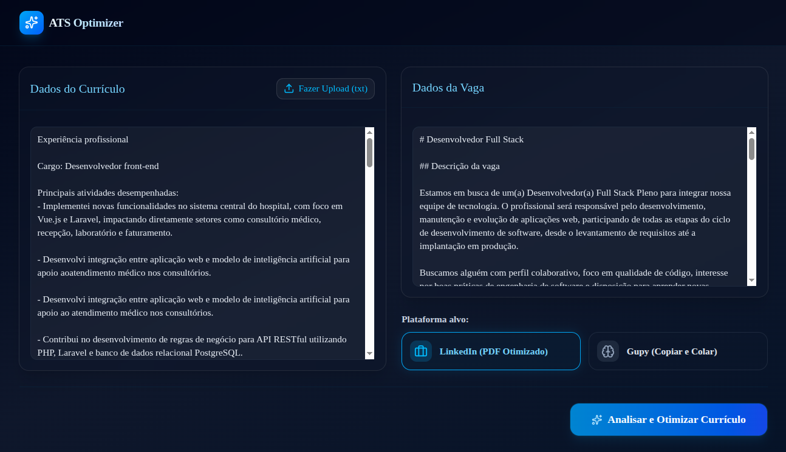
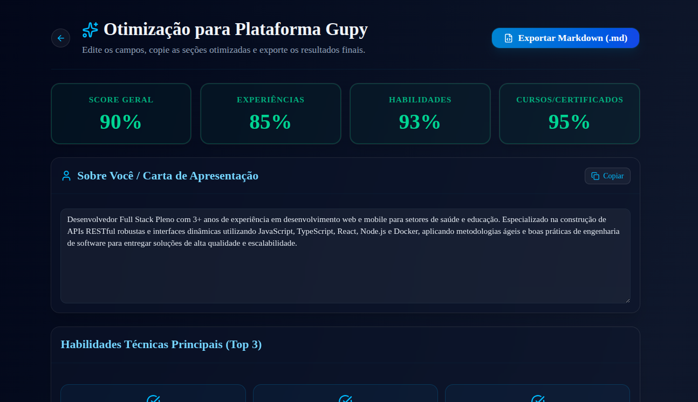
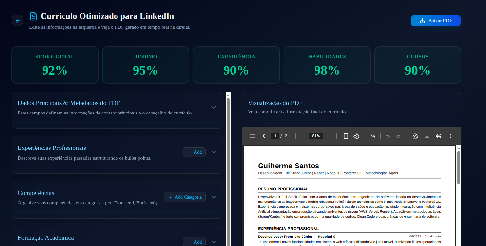

# Otimizador de Currículos para ATS (ATS Resume Optimizer)

Uma aplicação web moderna e inteligente desenvolvida para otimizar currículos com foco em passar nos filtros de sistemas de rastreamento de candidatos (ATS - Applicant Tracking Systems). A aplicação adapta o conteúdo original do currículo especificamente para a vaga de emprego fornecida e gera análises e recomendações personalizadas com base na plataforma alvo selecionada: **LinkedIn** ou **Gupy**.

---

## 📸 Demonstração Visual

Abaixo estão capturas de tela da aplicação em funcionamento:

### 1. Tela Inicial
A interface é baseada em uma arquitetura de estado único (SPA), com design escuro (dark mode), variações elegantes de azul, inputs com altura delimitada e rolagem vertical. O usuário cola o currículo atual (ou carrega via arquivo `.txt`), insere a descrição da vaga e escolhe o canal de otimização à direita.


### 2. Otimização para LinkedIn (Visualização & PDF)
No fluxo do LinkedIn, a aplicação calcula notas de aderência detalhadas e gera um currículo estruturado com competências organizadas por categorias. Permite a edição em tempo real das informações de contato, experiências, formação acadêmica e metadados, oferecendo a visualização direta e o download do PDF formatado em preto e branco (padrão preferencial dos leitores de ATS).


### 3. Otimização para Gupy (Campos e Exportação .md)
No fluxo da Gupy, os resultados geram blocos de texto otimizados (como a carta de apresentação, descrição de experiências com verbos de ação/método/impacto e tags curtas de habilidades) projetados especificamente para o algoritmo de triagem da plataforma. Permite edição ágil, cópia rápida com um clique e exportação de todo o conteúdo em arquivo Markdown (.md).


---

## 🛠️ Tecnologias Utilizadas

- **Core & Routing:** Next.js 16 (App Router) & Turbopack.
- **Linguagem:** TypeScript.
- **Estilização & Componentes:** Tailwind CSS, ShadcnUI e Base UI (painéis retráteis robustos).
- **Processamento de IA:** Server Actions integradas com a API do Google GenAI utilizando o modelo **Gemini 3 Flash Preview** (`gemini-3-flash-preview`), com mapeamento rígido de tipagem através de esquemas JSON estruturados via Zod.
- **Geração de PDF:** `@react-pdf/renderer` para geração vetorial e download direto do PDF no lado do cliente.

---

## 🌟 Principais Funcionalidades

### 📄 Canal LinkedIn (Foco em PDF Estruturado)
- **Nota de Aderência:** Métricas detalhadas (Score Geral, Resumo, Experiência, Habilidades e Cursos).
- **Competências Categorizadas:** Classificação de competências técnicas em categorias lógicas (Ex: Front-end, Metodologias, Ferramentas).
- **Editor Embutido:** Permite editar dados de contato (email, telefone, localização, perfis), headline, resumo profissional, experiências, competências e formação acadêmica diretamente na tela antes de exportar.
- **Exportação ATS-Friendly:** Download de currículo vetorial formatado em preto e branco com espaçamentos otimizados.
- **Feedback de IA:** Sugestões detalhadas de termos e itens a **Adicionar** ou **Remover** para aumentar a pontuação final.

### ⚡ Canal Gupy (Foco em Cópia e Cadastro)
- **Nota de Aderência Gupy:** Medição de compatibilidade baseada em palavras-chave da vaga e títulos de cargo.
- **Carta de Apresentação:** Geração de cover letter estruturada com o cargo padrão, especialidade, anos de experiência e impacto principal.
- **Tags Técnicas:** Identificação e formatação do Top 3 Competências em termos técnicos curtos (Ex: React, Node.js, AWS).
- **Exportação Markdown:** Download da análise e dos blocos de texto otimizados em um arquivo `.md`.

---

## 🚀 Como Executar o Projeto Localmente

### Pré-requisitos
Certifique-se de ter o [Node.js](https://nodejs.org/) instalado em sua máquina.

### Passo 1: Clonar o Repositório e Instalar Dependências
```bash
git clone <url-do-repositorio>
cd ats-optimizer
npm install
```

### Passo 2: Configurar Variáveis de Ambiente
Crie um arquivo `.env` na raiz do projeto e configure a sua chave de API do Gemini:
```env
GEMINI_API_KEY=sua_chave_de_api_aqui
```

### Passo 3: Iniciar o Servidor de Desenvolvimento
Execute o comando abaixo para iniciar o servidor Next.js localmente:
```bash
npm run dev
```
Acesse `http://localhost:3000` no seu navegador.

### Passo 4: Build de Produção
Para compilar a aplicação de forma otimizada para produção:
```bash
npm run build
npm run start
```
